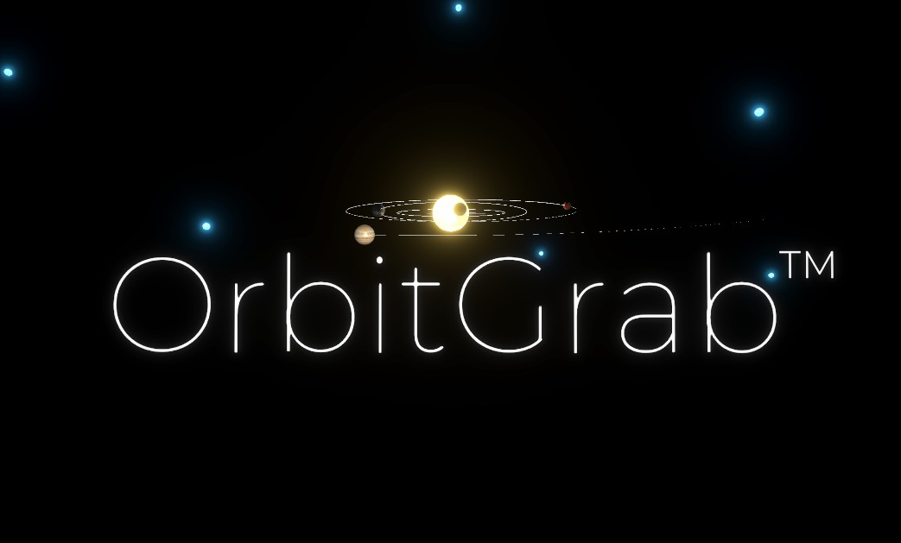
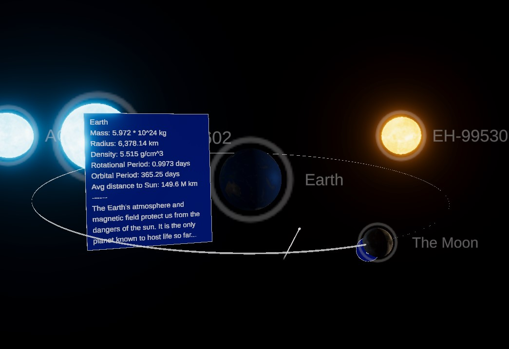
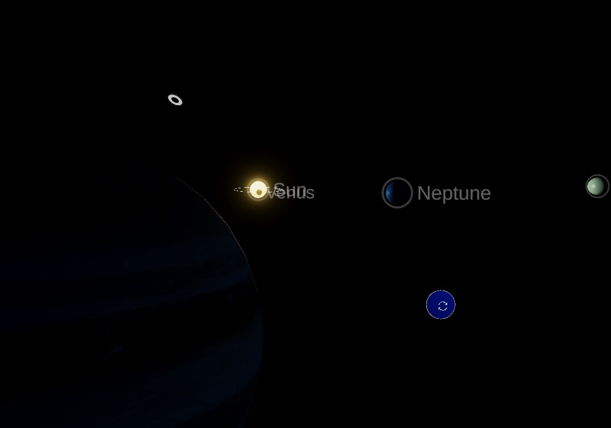

# PlanetariumMR

## Description

A mixed reality planetarium app developed for Lehigh CHOICES, an engineering and science outreach program aimed at middle-school girls to help foster STEM interest.

This gamified planetarium app has players explode rogue stars to help remake the solar system planet by planet. After popping a star, there's a chance for a planet
to appear out of the star dust remnants. Drag the planet toward the Sun in order to begin remaking the solar system. Users also get to learn about the statistics
and numbers relating to each of the planets along with one cool fact about that planet. Once all the stars are popped (other than our sun, of course) and all the
planets are back in the right place in the solar system, the player can sit back and relax, gazing at the eye candy that is the beauty of the solar system.

## Images

## Sources

Planet Textures:  
<https://www.solarsystemscope.com/textures/>

Factsheet of planets:  
<https://nssdc.gsfc.nasa.gov/planetary/factsheet/>

Planet Fun Facts:  
<https://spaceplace.nasa.gov/planets/en/>  
<https://solarsystem.nasa.gov/solar-system/our-solar-system/overview/>
